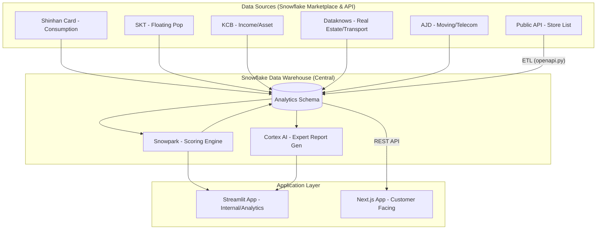

# 🏙️ Urban Mismatch Intelligence (Find Blue)

**Snowflake Cortex AI & Marketplace 데이터 기반 서울시 상권-주거 미스매치 분석 서비스**

서울시 주요 3개구(서초구, 영등포구, 중구)의 소비, 유동인구, 소득, 자산, 교통, 이사 수요 등 7종의 방대한 데이터를 결합하여 상권의 공급-수요 미스매치를 정밀 분석하고 AI 기반의 전문 컨설팅 리포트를 제공합니다.

---

## 🌟 핵심 기능
- **수요-공급 미스매치 시각화**: 소비 금액 대비 점포 밀집도를 분석하여 신규 진입 기회 지역(Blue Ocean) 파악.
- **업종별 맞춤 추천**: 카페, 음식점, 의료, 프리미엄 매장 등 업종 특성에 따른 7개 차원 가중치 적용 추천 시스템.
- **AI 전문가 분석**: Snowflake Cortex AI(Mistral-Large2)를 활용한 20년 경력 컨설턴트 수준의 분석 리포트 생성.
- **이사/통신 수요 모니터링**: 아정당 이사-통신 설치 데이터를 연계한 인구 유입 및 상권 성장성 선행 지표 추적.
- **지역 현황 대시보드**: 6종의 Snowflake Marketplace 데이터와 공공 API를 결합한 실시간 구/동별 데이터 모니터링.

---

## 🛠 기술 스택 (Tech Stack)

### Data & AI
- **Data Warehouse**: Snowflake (Central Intelligence)
- **AI/ML**: Snowflake Cortex AI (Mistral-Large2, XGBoost Inference)
- **Data Processing**: Snowflake Snowpark (Python API)
- **Data Sources**: 
  - Snowflake Marketplace (Shinhan Card, SKT, KCB, Dataknows)
  - Partner Data (Ajungdang Telecom/Rental Data)
  - Public API (Small Business Station Store Data)

### Application Architecture
- **Analytics Dashboard**: Streamlit (for Deep Dive Analysis & Expert Reports)
- **Web Frontend**: Next.js 15+, React 19, Tailwind CSS (for Consumer App)
- **Deployment**: Streamlit in Snowflake / Vercel

---

## 🏗 아키텍처 구조 (Architecture)



---

## 🚀 시작하기

### 1. 환경 변수 설정
`.env.local.example` 파일을 복사하여 `.env.local`을 생성하고 필요한 인증 정보를 입력합니다.
```bash
cp .env.local.example .env.local
```

### 2. Streamlit 실행 (분석 도구)
```bash
streamlit run streamlit_app.py
```

### 3. Next.js 실행 (웹 서빙)
```bash
npm install
npm run dev
```

---

## 📁 프로젝트 구조
- `streamlit_app.py`: 메인 데이터 분석 및 AI 리포트 생성 엔진
- `src/app/`: Next.js 기반 서비스 애플리케이션 프런트엔드
- `openapi.py`: 공공 API 데이터 수집 및 전처리 스크립트
- `snowflake.log`: 데이터 커넥션 로그 (Git 제외됨)
- `.env.local`: API Key 및 DB 접속 정보 (Git 제외됨)
